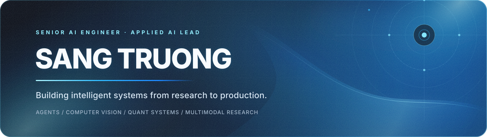

<div align="center">
  

  <br />

  <a href="https://sangtrx.github.io/sang-portfolio/"><b>Portfolio</b></a>
  &nbsp;·&nbsp;
  <a href="https://linkedin.com/in/tqsang"><b>LinkedIn</b></a>
  &nbsp;·&nbsp;
  <a href="https://scholar.google.com/citations?user=JG2yzhgAAAAJ"><b>Google Scholar</b></a>
  &nbsp;·&nbsp;
  <a href="mailto:tqsang97@gmail.com"><b>Email</b></a>
</div>

<br />

I build **production AI systems end to end** — from research, data and model/tool design to APIs, distributed workloads, product surfaces, deployment, observability and operational reliability.

Currently **Head of Artificial Intelligence at EPIC TECHNOLOGY**, with **6+ years** across agentic AI, LLM/RAG systems, computer vision and video intelligence, multimodal learning, quantitative ML, time-series systems and edge inference.

> My work sits where research has to survive contact with production.

---

## Selected systems

<table>
<tr>
<td width="50%" valign="top">

### 01 · Clinical AI & Decision Support

**Ho Chi Minh City Traditional Medicine Hospital**  
*AI Architect / Lead Builder · EPIC TECHNOLOGY*

Clinician-facing AI with governed knowledge retrieval, durable evidence state, exact citations, deterministic clinical authority and explicit validation boundaries.

[View case study →](https://sangtrx.github.io/sang-portfolio/work/yhct/)

</td>
<td width="50%" valign="top">

### 02 · Curren

**Quantitative intelligence & trading systems**  
*Independent side project · Solo Builder*

Point-in-time research evidence, shared causal event infrastructure, OOF and multiplicity governance, research↔streaming parity, ML quality gates, lifecycle/risk/execution and public verification surfaces.

[View case study →](https://sangtrx.github.io/sang-portfolio/work/curren/)

</td>
</tr>
<tr>
<td width="50%" valign="top">

### 03 · Video Intelligence

**Production multi-camera AI platform**  
*AI / Computer Vision Systems Lead*

Real-time camera ingest, YOLO perception, Vietnamese ALPR, tracking, temporal events, evidence capture, edge/runtime monitoring and automated recovery.

</td>
<td width="50%" valign="top">

### 04 · Enterprise Agents

**AI4U conversational agent**  
*AI Engineer · FPT Software*

Azure OpenAI agent platform with LangGraph/LangChain orchestration, Qdrant RAG, tool/model routing, controlled execution, memory, guardrails, multilingual speech and distributed workloads.

</td>
</tr>
</table>

---

## Technical depth

| Domain | What I work on |
|---|---|
| **Applied AI · Agents · RAG** | Agent orchestration, retrieval, tools, memory, voice/real-time AI, authority boundaries, evaluation, guardrails and production backends |
| **Computer Vision · Video · Edge** | Detection, ALPR/OCR, tracking, temporal events, media pipelines, TensorRT/CUDA, NVIDIA Jetson and physical-world reliability |
| **Quant Research · Trading Systems** | Causal/PIT evidence, Arrow/Parquet research infrastructure, leakage & selection controls, ML quality gates, lifecycle/risk/execution and reconciliation |
| **Research · Multimodal ML** | Temporal video understanding, vision-language learning, medical time-series representation learning and industrial computer vision |

```text
Python · Rust · FastAPI · PostgreSQL · Redis · RabbitMQ · Celery
PyTorch · TensorFlow · OpenCV · CUDA · TensorRT · ONNX Runtime
Azure OpenAI · LangGraph · LangChain · Qdrant · Milvus · pgvector
Arrow · Parquet · Polars · DuckDB · LightGBM · XGBoost · CatBoost
Docker · Linux · Kubernetes · Playwright · Next.js
```

---

## Research & engineering

**MEng, Computer Engineering — 4.0 / 4.0**  
Peer-reviewed work across **IJCV · AAAI · IEEE JBHI · Poultry Science · IEEE Access · ICIP · BMVC · IEEE BHI**.

My research spans temporal action understanding, vision-language modeling, video paragraph captioning, medical time-series learning and industrial computer vision — with a consistent interest in turning experimental methods into systems that can actually be evaluated, deployed and operated.

---

<div align="center">
  <sub>
    Ho Chi Minh City, Vietnam &nbsp;·&nbsp; Vietnamese / English
  </sub>
  <br /><br />
  <a href="https://sangtrx.github.io/sang-portfolio/"><b>Explore the full proof-of-work portfolio →</b></a>
</div>
